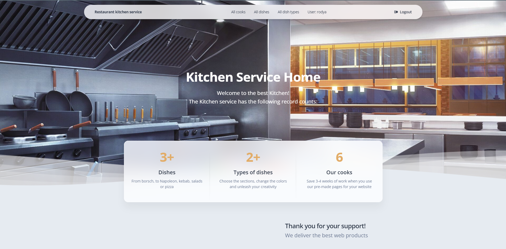

# Restaurant-kitchen-service
> My first Django project for managing cooks and dishes in restaurant 

## Check it out

[restaurant project deployd in web](https://restaurant-kitchen-service-1wze.onrender.com/cooks/)


## Installation
```shell
git clone https://github.com/ProdyRodion/restaurant-kitchen-service.git
python -m venv venv
source venv/bin/activate (on Linux/maOS)
venv\Scripts\activate (on Windows)
pip install -r requirements.txt
python manage.py runserver #starts Django Server
```

Now you ready to use my project at your computer.


## Features

* Registration for user
* Managing cooks and dishes
* Enjoyable front and back ends

